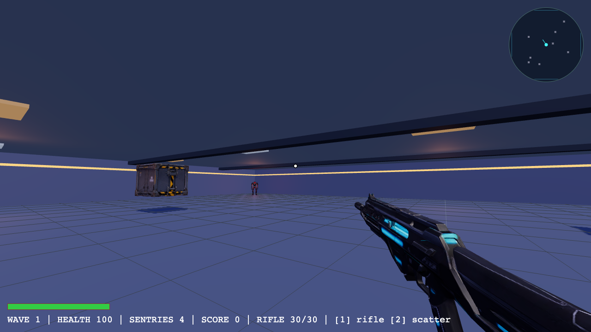

# Iron Descent

Browser FPS built with Three.js and local AI-assisted development.

**▶ Play:** https://cyrildieumegard.github.io/iron-descent/



## Gameplay

Survive waves of sentries in a hangar arena. Kills chain into score combos,
enemies drop health/ammo pickups, and each wave gets bigger and tougher.

| Input | Action |
| --- | --- |
| WASD | Move |
| Mouse | Aim / shoot |
| 1 / 2 | Switch rifle / scattergun |
| R | Reload |
| Space | Jump |
| Shift | Sprint |

Desktop browser with mouse + keyboard required.

## Development

```bash
npm install
npm run dev      # local dev server
npm run build    # production build in dist/
npm run preview  # preview the production build
```

Deployment to GitHub Pages is a plain static copy of `dist/` (plus `.nojekyll`)
on the `gh-pages` branch.

### Tech notes

- [Three.js](https://threejs.org) renderer, GLTF models compressed with
  meshopt + WebP textures (`gltf-transform optimize`), ~1.5 MB total assets.
- Only the rifle and the first enemy model block startup; the remaining models
  stream in the background and swap in seamlessly.
- 3D models were generated with [Meshy](https://www.meshy.ai) AI
  (see `scripts/generate-models.mjs`).

## License

Code license not chosen yet — all rights reserved until a `LICENSE` file is added.

3D models in `public/models/` were AI-generated with Meshy for this project.
